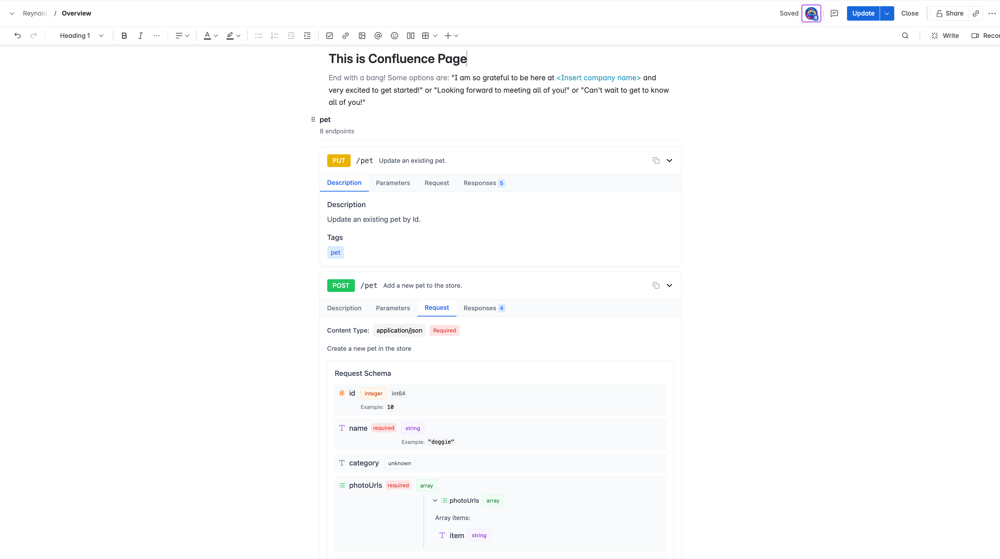

# Swagger Documentation for Confluence

A modern, React-based Confluence Cloud app that renders OpenAPI/Swagger documentation natively within Confluence pages. Display beautiful, interactive API documentation with filtering capabilities directly in your Confluence workspace.



## ✨ Features

- **🎯 Native Integration** - Seamlessly blends with Confluence's design system
- **📱 Responsive Design** - Works perfectly on desktop and mobile devices  
- **🔍 Smart Filtering** - Filter by API tags or show individual endpoints
- **🌐 URL-Based** - Load OpenAPI specs from any public URL
- **⚡ Real-time Preview** - See documentation before inserting into pages
- **🔒 Security Aware** - Built-in warnings for private URL usage
- **📋 Multiple Formats** - Supports OpenAPI 3.0 and Swagger 2.0

## 🚀 Quick Start

### For Confluence Users

1. **Install the app** in your Confluence Cloud instance using the app descriptor URL
2. **Create or edit** a Confluence page
3. **Insert macro** by typing `/swagger` or using the macro browser
4. **Configure URL** - Enter your OpenAPI specification URL
5. **Choose filters** (optional) - Select specific tags or endpoints
6. **Insert** - Beautiful API documentation appears in your page

### For Developers

#### Prerequisites

- Node.js 18+ and npm
- A Confluence Cloud instance (for testing)
- Netlify account (for hosting)

#### Installation

```bash
# Clone the repository
git clone https://github.com/reynldi/bring-swagger-to-confluence.git
cd swagger-confluence

# Install dependencies
npm install

# Start development server
npm run dev
```

The app will be available at `http://localhost:5173`

## 🛠️ Development

### Project Structure

```
swagger-confluence/
├── public/
│   ├── atlassian-connect.json    # Confluence app descriptor
│   └── embed.html               # Fallback embed page
├── src/
│   ├── components/              # React components
│   │   ├── ConfluenceMacroEditor.tsx
│   │   ├── ConfluenceMacroRenderer.tsx
│   │   ├── SwaggerRenderer.tsx
│   │   └── ...
│   ├── types/                   # TypeScript definitions
│   ├── data/                    # Sample data
│   └── utils/                   # Utility functions
├── netlify/functions/           # Serverless functions
└── ...
```

### Key Components

- **`ConfluenceMacroEditor`** - Configuration interface for the macro
- **`ConfluenceMacroRenderer`** - Displays the documentation in Confluence
- **`SwaggerRenderer`** - Core component that renders OpenAPI specs
- **`EndpointCard`** - Individual API endpoint documentation

### Running Locally

```bash
# Development mode with hot reload
npm run dev

# Build for production
npm run build

# Preview production build
npm run preview

# Type checking
npm run type-check

# Linting
npm run lint
```

## 🌐 Deployment

### Deploy to Netlify

1. **Fork this repository** to your GitHub account

2. **Connect to Netlify**:
   - Go to [Netlify](https://netlify.com)
   - Click "New site from Git"
   - Connect your GitHub repository
   - Set build command: `npm run build`
   - Set publish directory: `dist`

3. **Configure Environment** (optional):
   ```bash
   # Set in Netlify dashboard under Site settings > Environment variables
   VITE_APP_NAME=Your App Name
   VITE_BASE_URL=https://your-site.netlify.app
   ```

4. **Update App Descriptor**:
   ```json
   {
     "baseUrl": "https://your-site.netlify.app",
     "name": "Your Swagger Documentation App"
   }
   ```

5. **Deploy**: Netlify will automatically build and deploy your app

### Custom Domain (Optional)

1. Add custom domain in Netlify dashboard
2. Update `baseUrl` in `atlassian-connect.json`
3. Redeploy the application

## 📦 Confluence Installation

### Install in Confluence Cloud

1. **Access Confluence Admin**:
   - Go to Confluence settings
   - Navigate to "Manage apps"
   - Click "Upload app"

2. **Install App**:
   - Enter your app descriptor URL: `https://your-site.netlify.app/atlassian-connect.json`
   - Click "Upload"
   - Wait for installation to complete

3. **Verify Installation**:
   - Create a test page
   - Type `/swagger` or use macro browser
   - Configure with a public OpenAPI URL (e.g., Swagger Petstore)

### Troubleshooting Installation

**Common Issues:**

- **404 Error**: Verify the app descriptor URL is accessible
- **Installation Fails**: Check that `baseUrl` matches your actual domain
- **Macro Not Found**: Refresh Confluence page and try again
- **Loading Issues**: Ensure all HTTPS certificates are valid

## 🔧 Configuration

### App Descriptor

The `atlassian-connect.json` file configures the Confluence integration:

```json
{
  "name": "Your App Name",
  "key": "your-app-key",
  "baseUrl": "https://your-domain.com",
  "authentication": {
    "type": "none"
  },
  "modules": {
    "dynamicContentMacros": [...]
  }
}
```

### Customization

**Change App Name**: Update `name` in `atlassian-connect.json`
**Change App Key**: Update `key` (must be unique across Atlassian ecosystem)
**Styling**: Modify Tailwind classes in components
**Features**: Add new filtering options or display modes

## 🔒 Security Considerations

### ⚠️ Important Security Notes

- **Public URLs Only**: This app fetches OpenAPI specs client-side
- **URL Visibility**: URLs are stored in Confluence page data and visible to page viewers
- **No Authentication**: The app doesn't handle authenticated API specs
- **CORS Required**: Target APIs must allow cross-origin requests

### Best Practices

1. **Use Public APIs Only**:
   ✅ `https://petstore3.swagger.io/api/v3/openapi.json`
   ❌ `https://internal.company.com/api/spec.json`

2. **Review URLs Before Publishing**: Ensure no sensitive information in URLs

3. **Use HTTPS**: Always use secure URLs for OpenAPI specifications

4. **Regular Updates**: Keep dependencies updated for security patches

### For Enterprise Use

For internal/private APIs, consider:
- Deploying behind corporate firewall
- Implementing backend proxy service
- Adding authentication integration
- Using encrypted URL storage

## 🧪 Testing

### Manual Testing

1. **Test with Public APIs**:
   ```
   https://petstore3.swagger.io/api/v3/openapi.json
   https://api.github.com/openapi.json
   ```

2. **Test Filtering**:
   - Load Petstore API
   - Filter by "pet" tag
   - Filter to single endpoint

3. **Test in Confluence**:
   - Insert macro in different page types
   - Test with different user permissions
   - Verify mobile responsiveness

### Automated Testing

```bash
# Run type checking
npm run type-check

# Run linting
npm run lint

# Build test
npm run build
```

## 📋 Examples

### Basic Usage

```markdown
1. Insert Swagger Documentation macro
2. URL: https://petstore3.swagger.io/api/v3/openapi.json
3. Filter: All endpoints
4. Insert → Complete Petstore API documentation
```

### Filtered Usage

```markdown
1. Insert Swagger Documentation macro
2. URL: https://petstore3.swagger.io/api/v3/openapi.json
3. Filter: Specific tag → "pet"
4. Insert → Only pet-related endpoints
```

### Single Endpoint

```markdown
1. Insert Swagger Documentation macro
2. URL: https://petstore3.swagger.io/api/v3/openapi.json
3. Filter: Single endpoint → "PUT /pet - Update existing pet"
4. Insert → Just the update pet documentation
```

## 🤝 Contributing

We welcome contributions! Please see our contributing guidelines:

### Development Workflow

1. **Fork** the repository
2. **Create** a feature branch: `git checkout -b feature/amazing-feature`
3. **Commit** changes: `git commit -m 'Add amazing feature'`
4. **Push** to branch: `git push origin feature/amazing-feature`
5. **Open** a Pull Request

### Code Standards

- Use TypeScript for type safety
- Follow existing code style and formatting
- Add comments for complex logic
- Update documentation for new features

### Reporting Issues

Please use GitHub Issues to report bugs or request features:
- Include steps to reproduce bugs
- Provide example OpenAPI URLs when relevant
- Specify Confluence version and browser details

## 📝 License

This project is licensed under the MIT License - see the [LICENSE](LICENSE) file for details.

## 🙋 Support

### Documentation

- **Atlassian Connect**: [Developer Documentation](https://developer.atlassian.com/cloud/confluence/)
- **OpenAPI Specification**: [Official Docs](https://swagger.io/specification/)
- **React**: [Official Docs](https://react.dev/)
